# Architecture Overview

> **Welcome, contributor!** This guide takes you from "what is this project?" to "I can build features" in about 15 minutes.

## What You'll Learn

By the end of this document, you'll understand:

1. **What Timestamp does** and the problem it solves
2. **The mental model** — how to think about this codebase
3. **How data flows** — from user action to screen update
4. **Where to find things** — a map of the codebase
5. **Where to start contributing** — based on your interests

---

## The 30-Second Pitch

**Timestamp** is a countdown app where **every countdown is a URL**. Pick a date, choose a theme, add a message — the resulting URL works for anyone who opens it. No backend. No accounts. Pure client-side magic.

```
https://chrisreddington.com/timestamp/?mode=timer&duration=300&theme=fireworks&message=Break%20time!
```

**Three countdown modes:**
- 🏠 **Local Time** — New Year's Eve at *your* midnight
- 🌐 **Same Moment** — Product launch at one exact instant worldwide
- ⏱️ **Timer** — 5-minute break, starts when you open the link

---

## The Mental Model

Think of Timestamp like a **music player with swappable skins**:

```mermaid
flowchart LR
    subgraph Player["🎵 Orchestrator"]
        Timer[Countdown Timer]
        State[State Machine]
        Lifecycle[Theme Lifecycle]
    end
    
    subgraph Skins["🎨 Themes"]
        T1[Contribution Graph]
        T2[Fireworks]
        T3[Your Theme Here]
    end
    
    subgraph Controls["🎛️ UI Components"]
        Landing[Landing Page]
        Selector[Theme Selector]
        Map[World Map]
    end
    
    Player --> Skins
    Controls --> Player
```



| Concept | What It Does | Analogy |
|---------|--------------|---------|
| **Orchestrator** | Manages timing, state, lifecycle | The music player engine |
| **Themes** | Render the countdown visually | Swappable skins/visualizers |
| **Components** | User controls and settings | Play/pause/volume buttons |
| **Core** | Shared types and utilities | The audio codec library |

**The key insight:** The orchestrator decides *when* to update. Themes decide *how* to render. This separation means you can add wildly different visual themes without touching countdown logic.

### Why the Orchestrator Pattern?

The orchestrator exists to **guarantee consistency** across all themes. Without it, every theme would need to:

- Implement its own countdown timer (bugs in timing)
- Subscribe to reduced-motion preferences (inconsistent accessibility implementations)
- Handle tab visibility changes (battery drain)
- Manage celebration state transitions (inconsistent UX)

Instead, the orchestrator handles all of this **once**, then notifies themes via lifecycle hooks:

| Concern | Orchestrator Handles | Theme Receives |
|---------|---------------------|----------------|
| **Timing** | Single 1-second interval | `updateTime(time)` every tick |
| **Accessibility** | Monitors `prefers-reduced-motion` | `onReducedMotionChange(active)` |
| **Visibility** | Monitors page visibility | `onVisibilityChange(visible)` |
| **State** | Manages COUNTING → CELEBRATING → CELEBRATED | `onCounting()`, `onCelebrating()`, `onCelebrated()` |

**Result:** Theme authors focus purely on visuals. Accessibility, timing accuracy, and battery efficiency come for free.

## The Big Picture

Here's how the pieces fit together:


### The Three States

Every countdown moves through three states:


| State | What Happens | Theme Method Called |
|-------|--------------|---------------------|
| **COUNTING** | Timer running, display updating | `updateTime()` every second |
| **CELEBRATING** | Zero reached, animation playing | `onCelebrating()` |
| **CELEBRATED** | Animation done, final state | `onCelebrated()` |

**Why three states?** Because celebration needs time. We want to give theme authors the opportunity to celebrate that moment. For example, the GitHub Contribution Graph builds a wall of green squares, and transitions into the countdown message only after the animation completes.

---

## Following a Request Through the Code

Let's trace what happens when a user creates a countdown.

### Journey: User Creates a Timer

```mermaid
sequenceDiagram
    participant User
    participant Landing as Landing Page
    participant URL as URL Builder
    participant Orch as Orchestrator
    participant Theme as Theme Renderer
    
    User->>Landing: Fills form (30s timer, fireworks)
    Landing->>Landing: Validates input
    Landing->>URL: Build shareable URL
    URL->>Orch: Navigate + parse params
    Orch->>Theme: mount(container)
    Orch->>Theme: updateTime({...})
    loop Every Second
        Orch->>Theme: updateTime({...})
    end
    Orch->>Theme: onCelebrating()
    Theme->>User: 🎆 Fireworks!
```



### Journey: Every Second During Countdown

```mermaid
flowchart LR
    subgraph TimeLoop["Time Loop (1s interval)"]
        Tick[Tick!]
    end
    
    subgraph Calc["Time Calculation"]
        Target[Target Date]
        Now[Current Time]
        Remaining[Time Remaining]
    end
    
    subgraph Check["State Check"]
        Zero{Total ≤ 0?}
    end
    
    subgraph Update["Theme Update"]
        UpdateTime["updateTime(time)"]
        Celebrate["onCelebrating()"]
    end
    
    Tick --> Calc
    Calc --> Check
    Zero -->|No| UpdateTime
    Zero -->|Yes| Celebrate
```



---

## Codebase Map

Here's where to find everything:

```
src/
├── app/orchestrator/          # 🎵 The conductor
│   ├── orchestrator.ts        # Main coordinator
│   ├── controllers/           # Unified page controller
│   ├── theme-manager/         # Theme lifecycle & transitions
│   ├── time-manager/          # Countdown loop & calculations
│   └── ui/                    # Chrome visibility & colors
│
├── themes/                    # 🎨 Visual renderers
│   ├── registry/              # SINGLE SOURCE OF TRUTH
│   ├── theme-1/
│   ├── theme-2/
│   ├── ......
│   └── shared/                # Cleanup utilities
│
├── components/                # 🎛️ UI components
│   ├── landing-page/          # Configuration form
│   ├── theme-picker/          # Theme selection grid
│   ├── countdown-buttons/     # Share, fullscreen, etc.
│   ├── timezone-selector/     # Timezone dropdown
│   ├── world-map/             # Day/night visualization
│   └── mobile-menu/           # Hamburger menu
│
├── core/                      # 📦 Shared foundation
│   ├── types/                 # TypeScript interfaces
│   ├── config/                # Mode configuration
│   ├── state/                 # App state management
│   ├── time/                  # Time calculations and timezone utilities
│   ├── url/                   # URL building and parsing
│   └── utils/                 # Accessibility, DOM, performance
│
└── app/pwa/                   # 📱 Progressive Web App
    ├── registration.ts        # Service worker setup
    └── update-manager.ts      # App update handling
```

### Module Responsibilities

| Module | Single Responsibility | Key Files |
|--------|----------------------|-----------|
| `app/orchestrator/` | Coordinate theme lifecycle and state | [orchestrator.ts](../src/app/orchestrator/orchestrator.ts) |
| `app/orchestrator/controllers/` | Unified page lifecycle management | [page-controller.ts](../src/app/orchestrator/controllers/page-controller.ts) || `app/orchestrator/theme-manager/` | Theme loading and transitions | [theme-loader-factory.ts](../src/app/orchestrator/theme-manager/theme-loader-factory.ts), [theme-switcher.ts](../src/app/orchestrator/theme-manager/theme-switcher.ts) |
| `app/orchestrator/time-manager/` | Time loop and timer controls | [tick-scheduler.ts](../src/app/orchestrator/time-manager/tick-scheduler.ts), [timer-playback-controls.ts](../src/app/orchestrator/time-manager/timer-playback-controls.ts) || `core/state/` | App state (including celebration state) | [index.ts](../src/core/state/index.ts), [state-transitions.ts](../src/core/state/state-transitions.ts) |
| `themes/registry/` | Theme metadata & lazy loading | [registry-core.ts](../src/themes/registry/registry-core.ts) |
| `core/config/` | Mode-specific behavior | [mode-config.ts](../src/core/config/mode-config.ts) |

---

## Key Abstractions

### 1. Theme Registry — Single Source of Truth

All themes are registered in one place. The `ThemeId` type is auto-derived from registry keys — no hardcoding theme names!

```typescript
// src/themes/registry/registry-core.ts
export const THEME_REGISTRY = {
  'contribution-graph': createRegistryEntry(CONTRIBUTION_GRAPH_CONFIG, loadContributionGraphTheme),
  'fireworks': createRegistryEntry(FIREWORKS_CONFIG, loadFireworksTheme),
} as const;

// ThemeId is automatically: 'contribution-graph' | 'fireworks'
export type ThemeId = keyof typeof THEME_REGISTRY;
```

**To add a new theme:** Run `npm run create-theme my-theme` — it auto-registers.

**To check if a theme ID is valid:** Use `isValidThemeId()` from the registry.

📖 See [registry-core.ts](../src/themes/registry/registry-core.ts) for implementation.

### 2. Theme Renderers — The Two Required Interfaces

Every theme **must implement two interfaces**: one for the countdown page, one for the landing page background.


#### TimePageRenderer — Countdown Display

Renders the active countdown. The orchestrator calls these methods; your theme renders accordingly.


| Method | When Called | Theme's Job |
|--------|-------------|-------------|
| `mount()` | Theme selected | Set up DOM and animations |
| `updateTime()` | Every second | Update the countdown display |
| `onCelebrating()` | Timer hits zero | Start celebration animation |
| `onCelebrated()` | Already past zero | Show final state (no animation) |
| `onReducedMotionChange()` | User preference changes | Disable/enable animations |
| `destroy()` | Theme switching | Clean up everything |

> ⚠️ **Important:** Themes must **not** subscribe to `prefers-reduced-motion` or set up their own timers. The orchestrator handles all subscriptions and calls your lifecycle methods. This ensures consistent behavior and proper cleanup.

#### LandingPageRenderer — Landing Background

Renders the animated background behind the configuration form. Each theme provides its own visual style.


| Method | When Called | Theme's Job |
|--------|-------------|-------------|
| `mount()` | Page loads | Set up background animation |
| `setSize()` | Viewport resize | Adjust to new dimensions |
| `onVisibilityChange()` | Tab hidden/shown | Pause/resume animations |
| `destroy()` | Leaving page | Clean up everything |

**Examples:**
- **Contribution Graph**: Sparse grid of squares with occasional activity
- **Fireworks**: Night sky with twinkling stars

📖 See [types/index.ts](../src/core/types/index.ts) for both interfaces.

### 3. Mode Configuration — Behavior by Mode

Each countdown mode has different behavior. Instead of scattering `if (mode === 'timer')` checks everywhere, we centralize in `mode-config.ts`:

```typescript
// ✅ Good: Use semantic helpers
const config = getModeConfig(mode);
if (config.timezoneRelevantDuringCountdown) {
  showTimezoneSelector();
}

// ❌ Bad: Hardcoded string checks
if (mode === 'wall-clock') {
  showTimezoneSelector();
}
```

| Mode | `isDurationBased` | `timezoneRelevantDuringCountdown` |
|------|-------------------|-----------------------------------|
| `wall-clock` | `false` | `true` |
| `absolute` | `false` | `false` |
| `timer` | `true` | `false` |

📖 See [mode-config.ts](../src/core/config/mode-config.ts) for all properties.

### 4. State Machine — Lifecycle Management

The celebration state machine manages transitions between countdown states:

```typescript
const stateMachine = createCelebrationStateMachine();

stateMachine.transitionToCelebrating();  // Timer hit zero
stateMachine.transitionToCelebrated();   // Animation complete
stateMachine.transitionToCounting();     // Timezone switch back
```

📖 See [state/index.ts](../src/core/state/index.ts) and [state-transitions.ts](../src/core/state/state-transitions.ts).

---

## Dependency Rules

Clear boundaries keep the architecture clean:


| ✅ Allowed | ❌ Forbidden |
|-----------|-------------|
| `app/` → `core/`, `themes/registry` | `core/` → any other module |
| `components/` → `core/` | `themes/x/` → `themes/y/` (cross-theme) |
| `themes/` → `core/types`, `themes/shared` | Circular dependencies |

---

## Where to Start Contributing

Based on your interests, here's where to dive in:

### 🎨 "I want to build a theme"

**Start here:** [Theme Development Guide](THEME_DEVELOPMENT.md)

**Quick start:**
```bash
npm run create-theme my-theme
npm run dev
# Visit: http://localhost:5173/?mode=timer&duration=30&theme=my-theme
```

**Key files:**
- [src/themes/fireworks/](../src/themes/fireworks/) — Simple theme example
- [src/themes/contribution-graph/](../src/themes/contribution-graph/) — Complex theme example

### 🔧 "I want to fix a bug"

**Start here:** Check [open issues](https://github.com/chrisreddington/timestamp/issues)

**Key commands:**
```bash
npm run dev              # Start dev server
npm run test             # Run unit tests
npm run validate:iteration  # Full validation
```

### 🎛️ "I want to add a UI feature"

**Start here:** [src/components/](../src/components/)

**Architecture pattern:** Components are self-contained with:
- Main module (`index.ts`)
- DOM builders (`dom-builders.ts`)
- Event handlers (`event-handlers.ts`)
- Co-located tests (`*.test.ts`)

### ⚡ "I want to improve performance"

**Start here:** [complex-theme-patterns.instructions.md](../.github/instructions/complex-theme-patterns.instructions.md)

**Key patterns:**
- CSS-first animations (GPU-accelerated)
- `setTextIfChanged()` for DOM writes
- `createElement()` only for >1000 elements/render

### 📱 "I want to improve the PWA"

**Start here:** [src/app/pwa/](../src/app/pwa/)

**Key files:**
- [registration.ts](../src/app/pwa/registration.ts) — Service worker setup
- [update-manager.ts](../src/app/pwa/update-manager.ts) — App updates

---

## Essential Commands

| Command | Purpose |
|---------|---------|
| `npm run dev` | Start development server |
| `npm run test` | Run unit tests |
| `npm run test:e2e` | Run E2E tests (chromium, excludes @perf) |
| `npm run test:e2e:cross-browser` | E2E tests across all browsers |
| `npm run test:e2e:perf` | Performance profiling tests (long-running) |
| `npm run test:e2e:full` | Complete E2E suite including @perf tests |
| `npm run validate:iteration` | Full validation (before commits) |
| `npm run create-theme <name>` | Scaffold a new theme |

---

## Learning More

| Topic | Resource |
|-------|----------|
| Building themes | [Theme Development Guide](THEME_DEVELOPMENT.md) |
| URL parameters | [Deep Linking Guide](DEEP-LINKING.md) |
| Contributing | [Contributing Guide](../CONTRIBUTING.md) |
| TypeScript patterns | [TypeScript Handbook](https://www.typescriptlang.org/docs/handbook/intro.html) |
| Vite development | [Vite Guide](https://vite.dev/guide/) |
| Service Workers | [MDN Service Worker API](https://developer.mozilla.org/en-US/docs/Web/API/Service_Worker_API) |
| PWA concepts | [MDN Progressive Web Apps](https://developer.mozilla.org/en-US/docs/Web/Progressive_web_apps) |

---

## Glossary

| Term | Definition |
|------|------------|
| **Orchestrator** | The central coordinator that manages countdown timing, state, and theme lifecycle |
| **Theme** | A pluggable visual renderer implementing both `TimePageRenderer` and `LandingPageRenderer` |
| **Mode** | Countdown type: `wall-clock`, `absolute`, or `timer` |
| **Wall-clock time** | Time relative to a timezone (e.g., "midnight in Tokyo") |
| **Absolute time** | A fixed UTC instant (e.g., "2026-01-01T00:00:00Z") |
| **Registry** | Single source of truth for theme metadata and loaders |
| **Chrome** | UI controls around the countdown (buttons, selectors, map) |
| **Safe area** | The region where themes render, respecting UI chrome |

---

**Ready to contribute?** Pick a starting point above, or browse the [open issues](https://github.com/chrisreddington/timestamp/issues). Welcome to the project! 🎉
